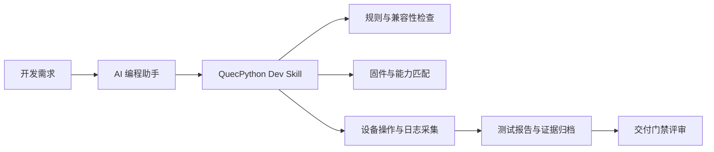
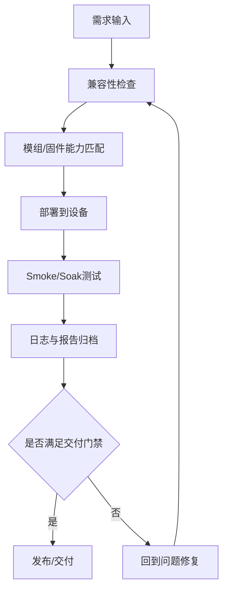

# QuecPython Dev Skill

> 面向 QuecPython 设备研发与运维的一体化 Skill（Coding + Device Ops + Firmware + Docs）

**维护单位：芯寰云（上海）科技有限公司**

## 项目简介

`quecpython-dev` 是一个面向通用 AI 编程助手/Agent 的专业 Skill，目标是把 QuecPython 研发链路中的高频、易错、难复盘流程标准化，包括：

1. 设备侧代码开发与兼容性约束检查
2. 模组能力与资源预算匹配
3. 固件生命周期管理（查询、下载、刷写、验证）
4. 串口/REPL 设备操作（`/usr` 文件系统、运行、巡检）
5. 官方文档检索与索引化
6. 长稳（Soak）与故障排查流程固化

该 Skill 聚焦“可执行、可复核、可交付”的工程实践，不以脚本单次成功作为最终结论，而强调证据链与人工复核边界。

## 系统概览（图）



## 使用环境说明

| 运行模式 | 说明 | 推荐度 |
|---|---|---|
| Windows 本机模式 | 在同一台 Windows 主机完成代码、工具、设备操作 | 高（单机调试） |
| Mac/Linux + Windows SSH 模式 | 在 Mac/Linux 编排，通过 SSH 驱动 Windows 工具链与设备 | 高（跨机协同） |
| CI/无人值守模式 | 在受控环境按固定端口与固定固件执行批处理验证 | 中（需强约束） |

最低建议输入上下文：

1. 模组型号（如 `EC800KCNLC`）
2. 固件版本（当前版本与目标版本）
3. 设备串口与波特率
4. 部署目标路径（如 `/usr/_main.py`）

## 核心能力矩阵

| 能力域 | 目标 | 关键脚本 |
|---|---|---|
| 兼容性检查 | 识别 CPython 到 QuecPython 的不兼容写法 | `scripts/check_quecpython_compat.py` |
| 模组能力查询 | 评估功能支持与资源预算（RAM/FS/运行内存） | `scripts/query_module_capability.py` |
| 文档检索 | 基于官方资料做关键词/章节/站点级查询 | `scripts/query_official_docs.py`, `scripts/query_qpy_docs_online.py`, `scripts/crawl_qpy_site_index.py` |
| 固件生命周期 | 版本发现、下载、能力匹配、刷写与后验验证 | `scripts/qpy_firmware_manager.py` |
| 设备操作 | `/usr` 目录操作、脚本下发、运行与清理 | `scripts/qpy_device_fs_cli.py` |
| 烟雾测试 | AT + REPL + 部署导入 + 日志采集 | `scripts/device_smoke_test.py` |
| 长稳测试 | 周期性执行 smoke 并输出统计报告 | `scripts/qpy_soak_runner.py` |
| 设备信息探测 | 一次性采集模组/固件/网络/SIM关键信息 | `scripts/qpy_device_info_probe.py` |
| 崩溃排查 | Windows 主机侧崩溃线索收集（只读） | `scripts/qpy_crash_triage.py` |
| 项目管理 | 官方项目发现、版本查询、clone/submodule | `scripts/qpy_project_manager.py` |
| Pin/GPIO 查询 | Pin 与 GPIO 映射线索检索 | `scripts/query_pin_map.py` |

## 快速开始

### 1. 安装 Skill

将仓库克隆后，放入你的 Skills 目录（路径按工具约定）：

```bash
# 示例路径（按你的工具配置调整）
# <SKILLS_HOME>/quecpython-dev
```

### 2. 先读规则，再执行脚本

```bash
python scripts/check_quecpython_compat.py --help
python scripts/query_module_capability.py --help
python scripts/device_smoke_test.py --help
```

### 3. 推荐执行顺序

1. 读取 `SKILL.md` 与 `references/core-rules.md`
2. 先做能力匹配（模组/固件/资源）
3. 再做设备操作（部署/运行/日志）
4. 关键变更后执行 smoke 或 soak
5. 按 `references/commercial-readiness.md` 做交付门禁

## 标准执行路径（图）



## 目录结构

```text
quecpython-dev/
├── SKILL.md                 # 技能触发描述、执行约束、输出契约
├── agents/openai.yaml       # Skill 元数据
├── scripts/                 # 可执行脚本能力
├── references/              # 流程规范与规则文档
├── assets/templates/        # 常用模板（网络、MQTT、UART-Modbus）
├── assets/stubs/            # QuecPython API stubs（接口形态参考）
├── LICENSE                  # Apache-2.0
└── NOTICE                   # 第三方归因说明
```

## 脚本清单（按职责分组）

### A. 规则与能力判断

1. `scripts/check_quecpython_compat.py`：语法/用法兼容性检查
2. `scripts/query_module_capability.py`：模组能力/资源筛选
3. `scripts/query_pin_map.py`：Pin/GPIO 映射线索查询

### B. 文档与知识发现

1. `scripts/query_official_docs.py`：官方文档关键词查询
2. `scripts/query_qpy_docs_online.py`：在线索引增强检索
3. `scripts/crawl_qpy_site_index.py`：站点索引抓取
4. `scripts/normalize_qpy_docs.py`：导入文档规范化

### C. 设备运维与验证

1. `scripts/device_smoke_test.py`：端到端烟雾验证
2. `scripts/qpy_device_fs_cli.py`：`/usr` 文件系统操作
3. `scripts/qpy_device_info_probe.py`：设备基本信息探测
4. `scripts/qpy_soak_runner.py`：长稳巡检与统计
5. `scripts/qpy_crash_triage.py`：主机崩溃线索分析

### D. 固件与项目管理

1. `scripts/qpy_firmware_manager.py`：固件查询/下载/刷写/后验
2. `scripts/qpy_project_manager.py`：官方项目发现与版本管理
3. `scripts/qpy_tool_paths.py`：工具路径与环境辅助

## 输出与交付契约

当使用该 Skill 输出方案或代码时，建议最少包含：

1. 可部署代码与明确目标路径（例如 `/usr/_main.py`）
2. 环境前置条件（模组型号、固件版本、串口、波特率）
3. 执行步骤与回滚建议
4. 兼容性检查结果与未覆盖风险
5. 证据文件路径（日志、JSON 报告、版本对比）

## 安全与风险说明

1. 刷写、强制进程处理、qpycom 高风险操作必须显式确认后执行
2. 不要在无端口确认、无版本确认情况下执行 destructive 操作
3. 生产放行必须结合人工复核，不以单脚本成功作为唯一依据

## 常见问题（FAQ）

1. 兼容性检查通过是否代表可商用上线？
   不是。兼容性检查仅覆盖代码层风险，仍需结合设备实测、网络稳定性、异常恢复、回归验证与人工复核。
2. 为什么强调 `module + firmware + port` 三元上下文？
   设备行为与模组型号、固件版本和串口环境强相关，缺少任一要素都会显著降低结论可信度。
3. 为什么要区分 smoke 与 soak？
   Smoke 用于快速发现致命问题；Soak 用于长稳与偶发故障识别，二者目标不同，需分层执行。

## 附录 A（推荐）：SSH 跨电脑联调（Mac -> Windows -> 设备）

在实际研发中，推荐将本 Skill 与 `windows-ssh-control` 组合使用，形成跨机协同链路。

开源项目链接：

- [Windows SSH Control Skill](https://github.com/LiteChipCloud/windows-ssh-control-skill)

建议命令编排（示意，使用占位路径而非固定目录）：

```bash
# 1) 本机先做兼容性检查
python scripts/check_quecpython_compat.py code/

# 2) 通过 SSH 在 Windows 执行设备巡检（示意）
./scripts/winctl.sh ps "python <WINDOWS_PROJECT_DIR>/scripts/device_smoke_test.py --risk-mode safe --auto-ports --json"

# 3) 回传报告到本机（示意）
./scripts/winctl.sh copy-from "<WINDOWS_REPORT_DIR>/device-smoke.json" ./review/device-smoke.json
```

## 附录 B（推荐）：MCP 与 Skill 协同建议

建议在任意支持 MCP/Skills 的 AI 编程助手中同时启用：

1. GitHub MCP：用于仓库、Issue、Release 与版本治理
2. Windows SSH Skill：用于跨机执行与设备链路接管
3. QuecPython Dev Skill：用于业务代码与设备流程能力

## 开源借鉴与协议合规说明

本项目在 `assets/stubs/quecpython_stubs/` 中借鉴并再分发了以下上游项目的接口桩（stubs）资产：

- 上游仓库：[`QuecPython/qpy-vscode-extension`](https://github.com/QuecPython/qpy-vscode-extension)
- 上游 LICENSE：[`LICENSE`](https://github.com/QuecPython/qpy-vscode-extension/blob/master/LICENSE)

当前合规策略：

1. 保留第三方归因文档：`references/third-party-attribution.md`
2. 在仓库根目录提供 `NOTICE`
3. 在仓库根目录提供 `LICENSE`（Apache-2.0）
4. 在 README 明确标注借鉴来源与链接

## 开源许可证

1. 本仓库采用 `Apache-2.0`，详见 `LICENSE`
2. 第三方 stubs 归因与说明详见 `NOTICE` 与 `references/third-party-attribution.md`

## 维护信息

- 维护单位：**芯寰云（上海）科技有限公司**
- 仓库用途：QuecPython 工程化 Skill 能力沉淀与复用
- 建议反馈方式：GitHub Issues / Pull Requests
