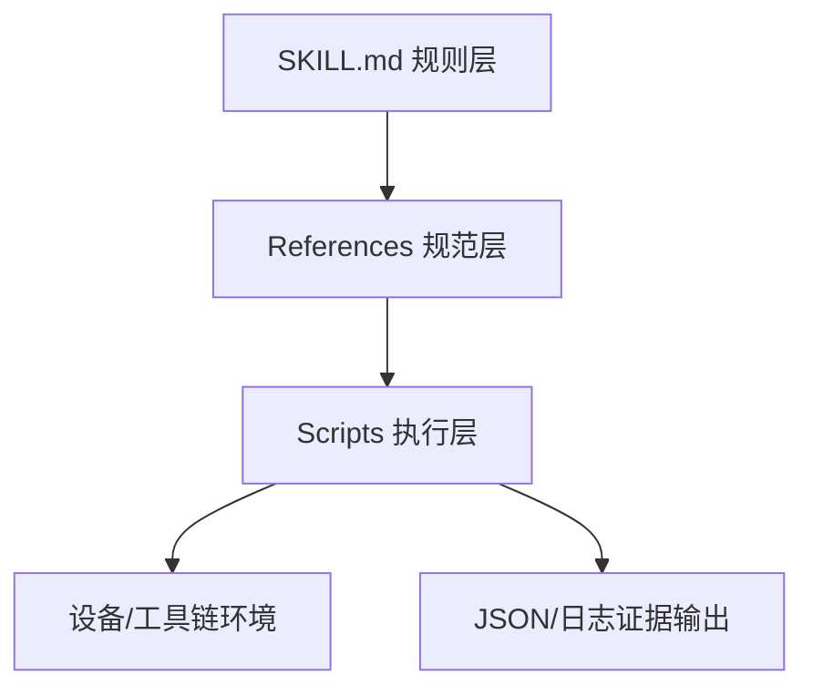

# 01 技能总体架构设计

## 1. 设计目标

1. 把 QuecPython 研发流程标准化为可重复执行链路。
2. 同时覆盖“编码质量”和“设备联调”两条主线。
3. 以证据链为导向，避免只给“口头结论”。

## 2. 分层模型

## 3. 模块职责

| 层级 | 目录 | 职责 |
|---|---|---|
| 规则层 | `SKILL.md` | 触发条件、强约束、输出契约 |
| 参考层 | `references/` | 规则细节、流程规范、商用门禁 |
| 执行层 | `scripts/` | 兼容性、设备操作、固件、排障 |
| 资产层 | `assets/` | 模板与 stubs 复用 |

## 4. 关键原则

1. 先规则，后执行。
2. 先兼容，再部署。
3. 高风险动作必须显式确认。
4. 输出必须附带可复核证据。
