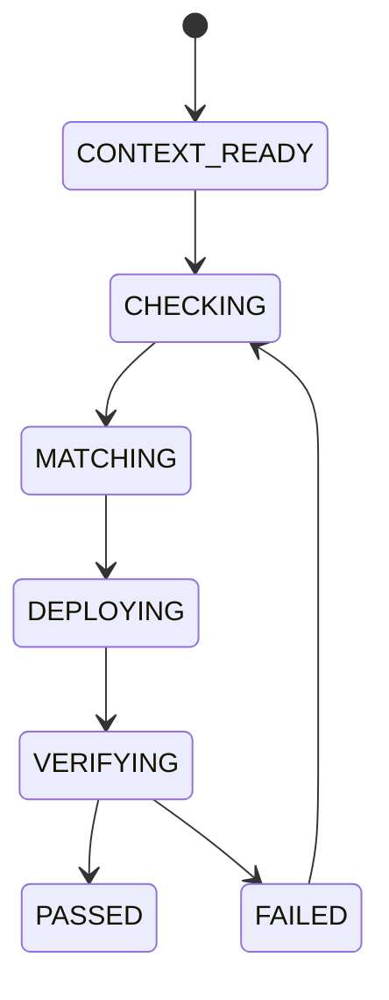

# 02 脚本编排与执行状态机

## 1. 标准编排链路

## 2. 状态机

## 3. 失败处理策略

| 失败点 | 处理动作 |
|---|---|
| 兼容性失败 | 回退代码并修复不兼容语法/API |
| 能力不满足 | 调整模组/固件/特性目标 |
| 部署失败 | 检查端口、权限、文件路径 |
| 验证失败 | 追加日志采集并重试最小闭环 |

## 4. 输出契约

每次执行建议输出：
1. 执行命令与参数摘要
2. 结果码与失败点
3. 日志/报告路径
4. 下一步建议（可执行）
